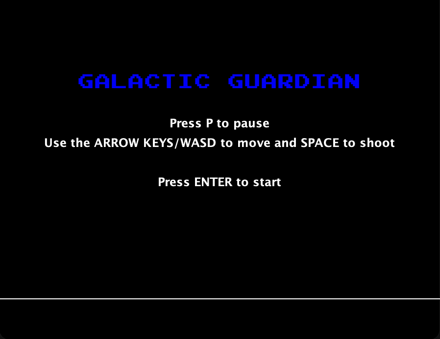
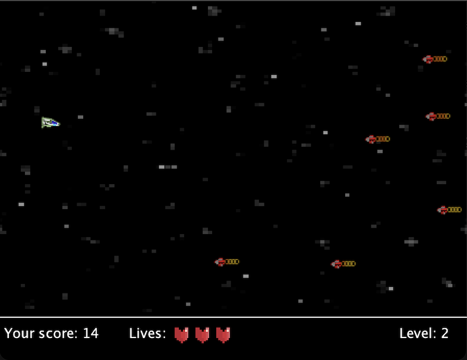
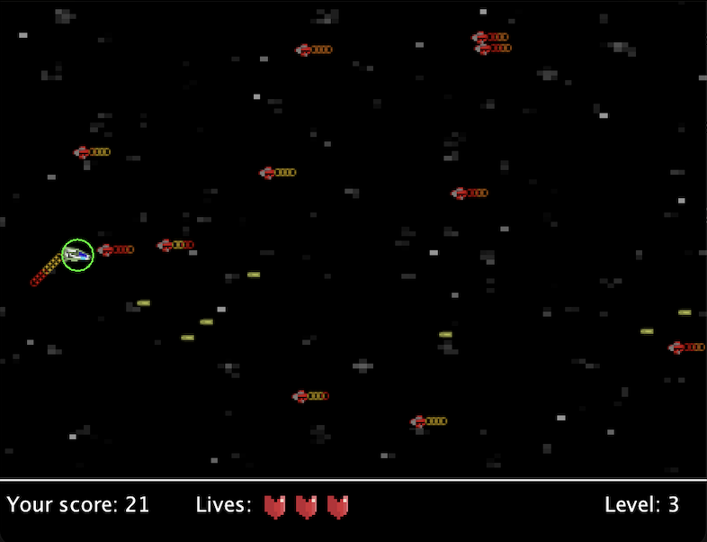

# Galactic Guardian



<br>
Galactic Guardian is an exciting infinite space shooter game developed in Java. Take control of a small spaceship and engage in intense battles against waves of alien ships. Equip yourself with powerful upgrades, face challenging bosses, and save the galaxy from the impending alien invasion!

## Features

- **Classic Space Shooter Gameplay**: Experience the thrill of classic space shooter action as you navigate through space and shoot down waves of alien invaders.

- **Powerful Upgrades**:

  - _Shield_: Activate the shield to become invincible for a short duration, protecting your ship from enemy attacks.
  - _Supershot_: Unleash a powerful shot that pierces through multiple enemies, clearing a path in your way.
  - _Bomb_: Deploy a devastating bomb that wipes out all enemies on the screen, providing a moment of relief in the heat of battle.

- **Challenging Boss Battles**: Every five levels, face off against a formidable boss ship. Strategize and find their weaknesses to emerge victorious.

## Screenshots


<br>


## How to Play

- **Movement**: Use the arrow keys or WASD to move your ship.
- **Shooting**: Press the spacebar to shoot.
- **Powerups**: Collect powerups to activate them.
- **Pause**: Press the P key to pause the game.

## How to Run

1. Clone the repository.
2. Open the project in your IDE of choice.
3. Run the `App` class located in the `src` folder.

```bash
git clone https://github.com/danfupo03/Galactic_Guardian.git

cd src

javac App.java

java App
```

4. Enjoy!
